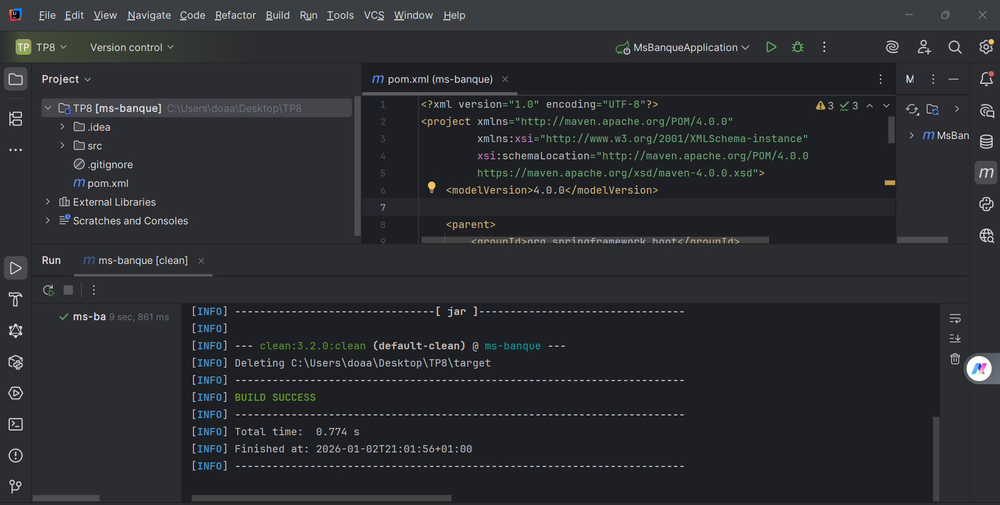

## 🧹 Maven Clean – ms-banque

The following screenshot shows the successful execution of the Maven `clean`
lifecycle for the **ms-banque** Spring Boot project.

This step removes the `target` directory and ensures a clean build environment
before compilation or packaging.

